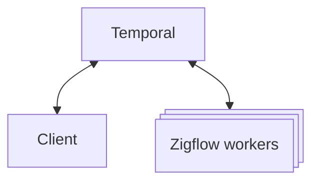

# Your Temporal Server

Zigflow works with all Temporal server types. [Cloud](https://temporal.io/cloud)
is best for high-performance, production workflows and [Self-Hosted](https://docs.temporal.io/self-hosted-guide)
is great for smaller workflows and development/testing.

For ease, this example uses the development server bundled with the
[Temporal CLI](https://docs.temporal.io/cli)

```sh
temporal server start-dev
```

## How does Zigflow and Temporal

A Temporal-enabled application can be thought of as three parts.

1. **The client**

    This is part of the application that makes the request. It takes the request
    from your app and hands it off to Temporal to fulfil it. Its responsibilities
    are:
      * starting the workflow
      * querying the workflow state
      * updating the workflow
      * awaiting the returned data (or error) and handling it

1. **The Temporal server**

    This acts as the bridge between the client and worker. Its responsibilities
    are:
      * persisting the workflow's state
      * dispatching tasks to the workers

    This provides the strong guarantees that makes your app crash-proof.

1. **The worker(s)**

    The workhorse of the operation. It provides your deterministic workflow and
    hosts your activity code. Conceptually, this receives the data from Temporal,
    but it actually polls Temporal to ask for work to complete.

    This is what Zigflow builds and manages.

---

Architecturally, the data flow looks like this:


