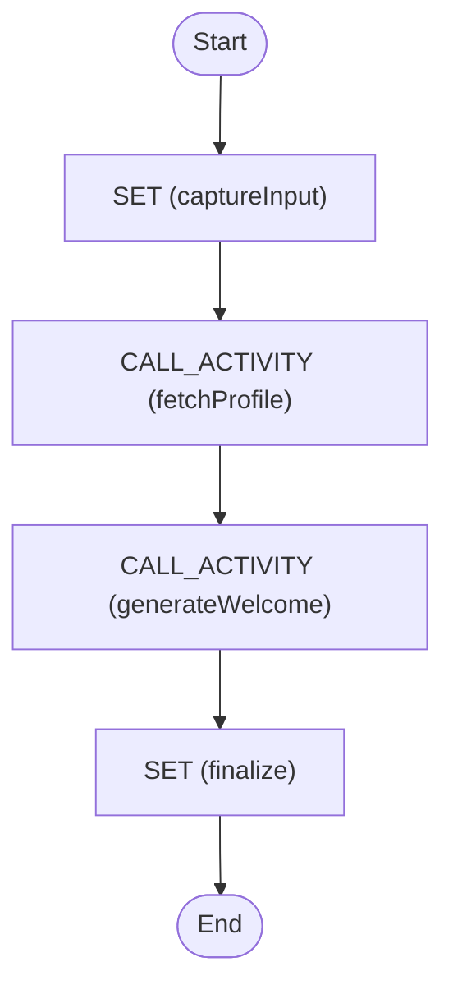

# Activity Call

Invoke existing Temporal activities directly from the DSL using the `call: activity`
task type.

## Getting started

You need two workers:

1. **DSL worker** – loads the workflow definition and runs the workflow logic.
2. **Activity worker** – registers the concrete activities that the DSL calls on
   the dedicated `activity-call-worker` task queue.

### 1. Start the DSL worker

```sh
task worker NAME=activity-call
```

### 2. Start the activity worker

```sh
cd examples/activity-call
go run ./worker
```

### 3. Start the workflow

With both workers running, trigger the workflow with any input:

```sh
cd examples/activity-call
go run .
```

You should see structured profile data and the generated welcome message in the
output payload.

## Diagram

<!-- ZIGFLOW_GRAPH_START -->

<!-- ZIGFLOW_GRAPH_END -->
