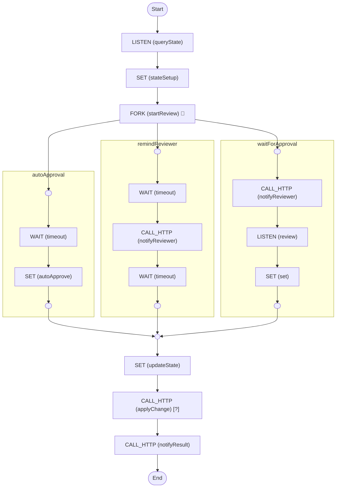

# Authorise Change Request

A flow chart to authorise change requests

<!-- toc -->

* [Getting started](#getting-started)
* [Diagram](#diagram)

<!-- Regenerate with "pre-commit run -a markdown-toc" -->

<!-- tocstop -->

## Getting started

```sh
go run .
```

This will trigger the workflow with some input data and print everything to the
console.

There are two prompts at runtime:

1. Should we approve or reject the change? Approve by default.
1. After how long should the response be sent? 15 seconds by default.

## Diagram

<!-- ZIGFLOW_GRAPH_START -->

<!-- ZIGFLOW_GRAPH_END -->
