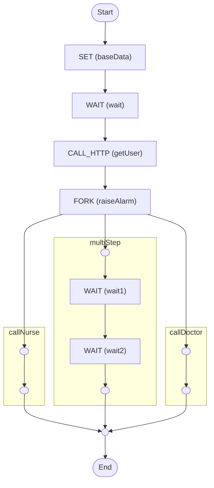

# CloudEvents

An example of how to use [CloudEvents](https://cloudevents.io) for debugging workflows

<!-- toc -->

* [Getting started](#getting-started)
  * [Running the workflow](#running-the-workflow)
  * [Starting the workflow](#starting-the-workflow)
    * [http](#http)
    * [file](#file)
* [Diagram](#diagram)

<!-- Regenerate with "pre-commit run -a markdown-toc" -->

<!-- tocstop -->

## Getting started

### Running the workflow

```sh
docker compose up workflow
```

### Starting the workflow

```sh
docker compose up trigger
```

This will trigger the workflow with some input data and print everything to the
console.

There are two CloudEvents (`http` and `file`) configured in the `cloudevents.yaml`
file which will send events to the relevant listeners.

#### http

This can be observed by running:

```sh
docker compose logs -f http
```

#### file

This will save all the workflow events to a file inside `./tmp`. The file name
will be in the format `<workflowID>.yaml` and the data will be appended to each
file.

## Diagram

<!-- ZIGFLOW_GRAPH_START -->

<!-- ZIGFLOW_GRAPH_END -->
