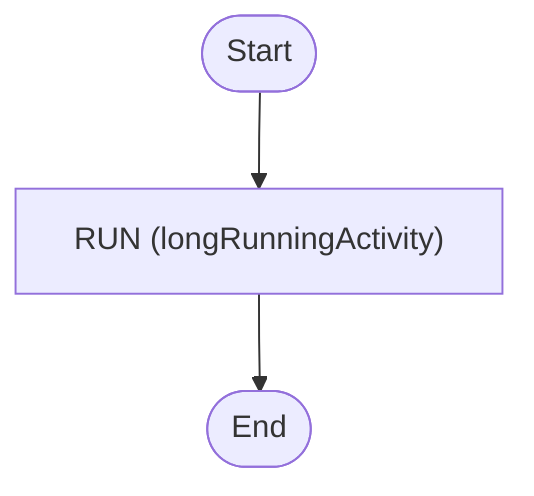

# Heartbeat

Set [activity heartbeat](https://docs.temporal.io/encyclopedia/detecting-activity-failures#activity-heartbeat).
Useful on long-running activities.

<!-- toc -->

* [Getting started](#getting-started)
* [Diagram](#diagram)

<!-- Regenerate with "pre-commit run -a markdown-toc" -->

<!-- tocstop -->

## Getting started

```sh
go run .
```

This will trigger the workflow with a heartbeat running in the background.

## Diagram

<!-- ZIGFLOW_GRAPH_START -->

<!-- ZIGFLOW_GRAPH_END -->
