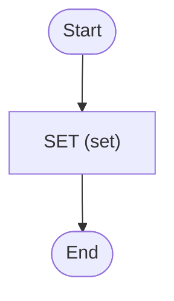

# Hello World Encrypted

Hello world with Zigflow, but [encrypted](https://github.com/mrsimonemms/temporal-codec-server)

<!-- toc -->

* [Getting started](#getting-started)
* [Diagram](#diagram)

<!-- Regenerate with "pre-commit run -a markdown-toc" -->

<!-- tocstop -->

## Getting started

> For an example Codec Server, check out
> [mrsimonemms/temporal-codec-server](https://github.com/mrsimonemms/temporal-codec-server)

```sh
go run .
```

This will trigger the workflow and print everything to the console. When you look
in the [Temporal UI](http://localhost:8233), all the data will be encrypted.

## Diagram

<!-- ZIGFLOW_GRAPH_START -->

<!-- ZIGFLOW_GRAPH_END -->
