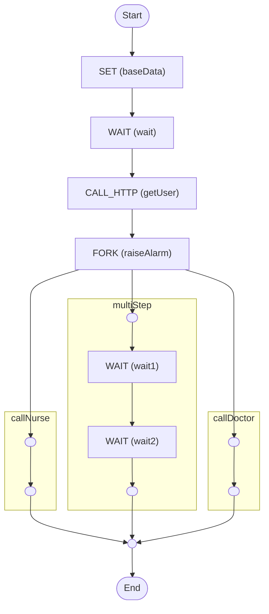

# Python

The [basic example](../basic/), but in Python

<!-- toc -->

* [Getting started](#getting-started)
* [Diagram](#diagram)

<!-- Regenerate with "pre-commit run -a markdown-toc" -->

<!-- tocstop -->

## Getting started

```sh
uv sync
uv run python main.py
```

`uv sync` creates a local virtual environment (by default at `.venv/`) and
installs the dependencies declared in `pyproject.toml`. `uv run python main.py`
runs the script inside that environment, triggering the workflow with some
input data and printing everything to the console.

## Diagram

<!-- ZIGFLOW_GRAPH_START -->

<!-- ZIGFLOW_GRAPH_END -->
