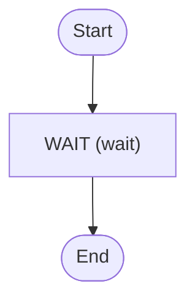

# Schedules

How to set a schedule

<!-- toc -->

* [Getting started](#getting-started)
* [Diagram](#diagram)

<!-- Regenerate with "pre-commit run -a markdown-toc" -->

<!-- tocstop -->

## Getting started

No trigger is configured. See the Schedules section in the Temporal UI

## Diagram

<!-- ZIGFLOW_GRAPH_START -->

<!-- ZIGFLOW_GRAPH_END -->
