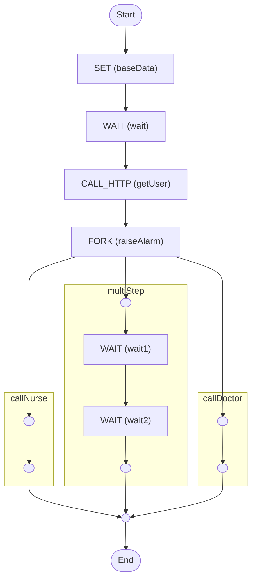

# TypeScript

The [basic example](../basic/), but in TypeScript

<!-- toc -->

* [Getting started](#getting-started)
* [Diagram](#diagram)

<!-- Regenerate with "pre-commit run -a markdown-toc" -->

<!-- tocstop -->

## Getting started

```sh
npm run dev
```

This will trigger the workflow with some input data and print everything to the
console.

## Diagram

<!-- ZIGFLOW_GRAPH_START -->

<!-- ZIGFLOW_GRAPH_END -->
